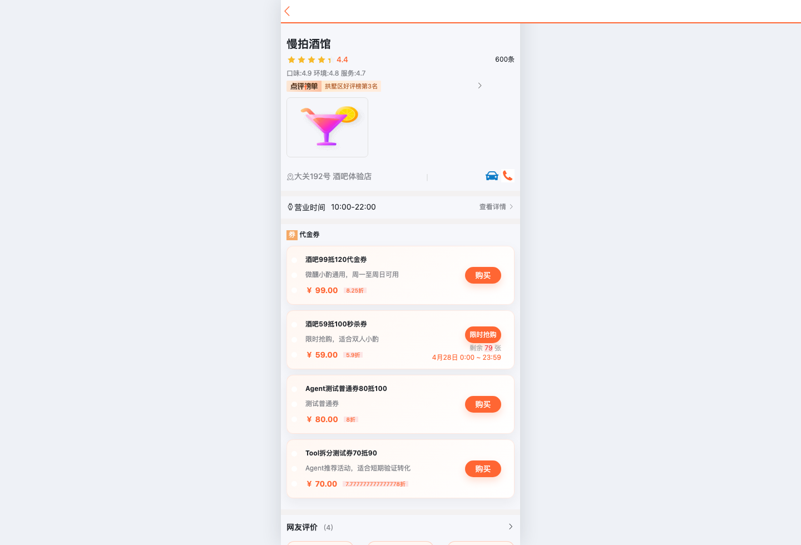
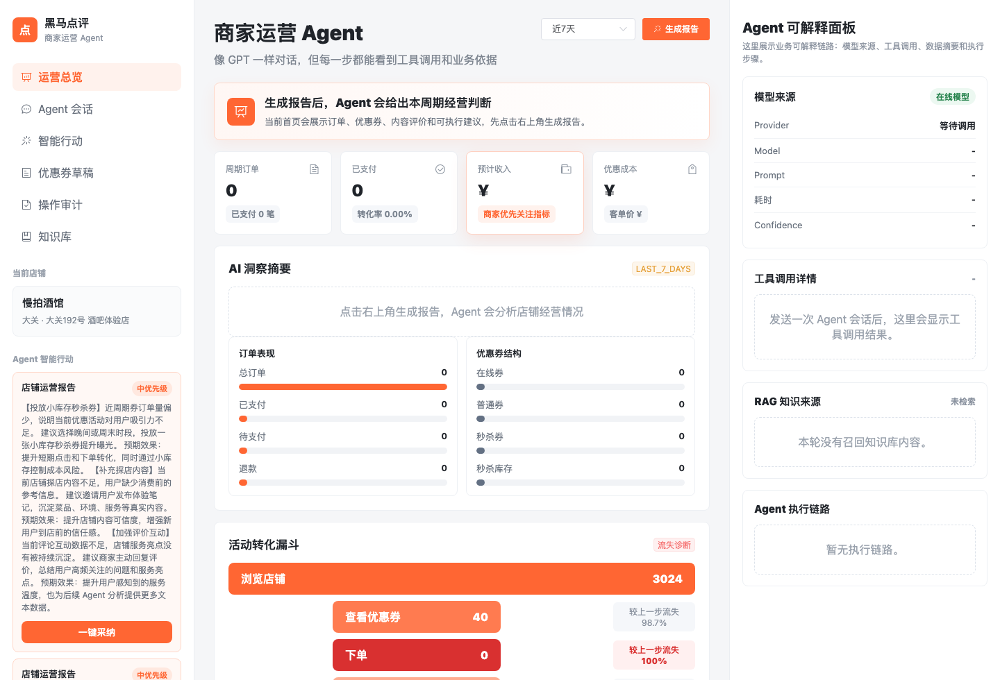
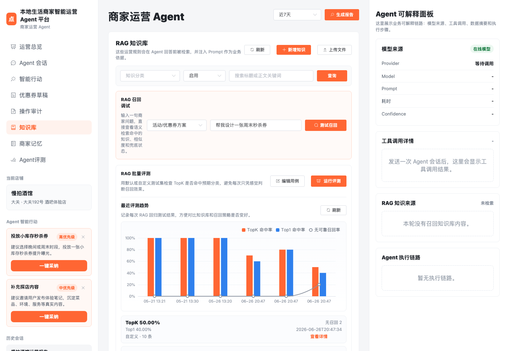
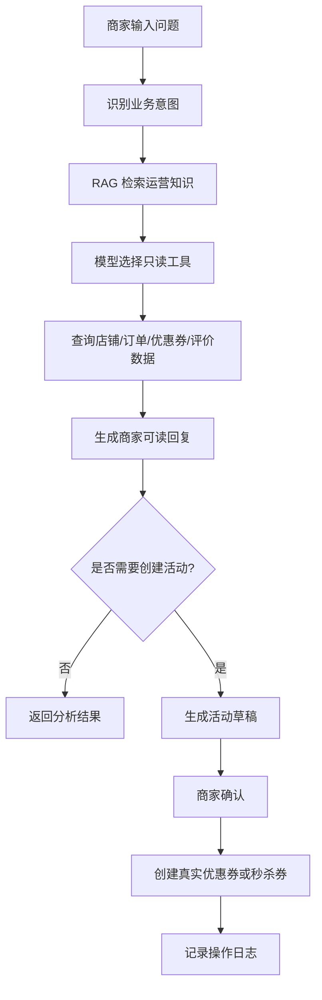

# 黑马点评升级版：本地生活商家智能运营 Agent 平台

这是一个基于黑马点评实战项目扩展的本地生活平台后端项目。项目保留了用户端店铺、优惠券、秒杀、探店、关注、签到等核心业务，并在此基础上新增了面向商家的智能运营 Agent 模块。

项目目标不是单纯做一个聊天机器人，而是把已有本地生活业务能力封装成 Agent 可调用的工具，让 Agent 基于真实业务数据为商家生成可执行、可追踪、可确认的运营建议。

## 项目亮点

- Redis 实战完整链路：缓存、分布式锁、Lua 秒杀、Stream 异步下单、BitMap 签到、Feed 流、GEO 附近商户。
- 优惠券秒杀闭环：库存校验、一人一单、异步下单、订单券码、商家核销视角。
- 达人探店与社交能力：发布探店笔记、点赞、点赞榜、关注、共同关注、关注 Feed。
- 商家运营 Agent：自然语言对话、工具调用、Prompt 模板、RAG 知识库、向量化、评测用例、活动草稿确认。
- Human-in-the-loop：Agent 只生成建议和草稿，创建真实优惠券/秒杀券必须由商家确认。
- 可追踪能力：会话、消息、建议、草稿、操作日志、模型调用信息、RAG 召回信息均可记录和展示。

## 项目截图

### 用户端店铺详情与优惠券



### 商家运营 Agent 工作台



### RAG 知识库召回与批量评测



## 技术栈

- Java 8
- Spring Boot 2.3.12
- MyBatis-Plus
- MySQL
- Redis
- Lua
- Redis Stream
- Hutool
- LangChain4j
- DashScope / 通义千问
- Vue 2 + Element UI
- Nginx 静态前端

## 核心业务模块

### 用户端业务

- 手机号验证码登录
- 用户资料编辑
- 店铺分类与店铺详情
- 附近商户与排序筛选
- 普通代金券购买
- 秒杀券抢购
- 用户订单与券码展示
- 签到与连续签到统计
- 达人探店笔记发布
- 探店点赞与点赞榜
- 关注、取关、共同关注
- 关注 Feed 流

### Redis 实战能力

| 场景 | Redis 能力 |
| --- | --- |
| 店铺缓存 | String 缓存、缓存穿透处理 |
| 秒杀下单 | Lua 原子扣减、一人一单校验 |
| 异步下单 | Redis Stream 消息队列 |
| 签到 | BitMap |
| 关注关系 | Set |
| Feed 流 | Sorted Set |
| 附近商户 | GEO |

### 商家运营 Agent 模块

Agent 模块面向商家，支持：

- 查询店铺经营报告
- 分析订单表现
- 分析优惠券结构
- 分析评价和探店内容
- 生成运营建议
- 生成优惠券/秒杀券活动草稿
- 商家确认后创建真实活动
- 活动效果复盘
- RAG 知识库维护
- 知识文档向量化
- RAG 召回调试
- RAG 批量评测和评测用例持久化

## Agent 设计原则

本项目中的 Agent 遵守一个核心原则：

> Agent 负责分析、建议和准备方案；商家负责确认关键动作。

因此，Agent 不会直接执行高风险操作：

- 不自动退款
- 不自动取消订单
- 不自动删除活动
- 不自动群发消息
- 不绕过商家确认创建真实优惠券或秒杀券
- 不修改支付、核销、库存等高风险状态

## 开发笔记维护约定

后续每完成一个功能点，除了提交代码，也同步维护项目笔记，方便复盘和面试讲解。

固定写法：

1. `README.md`：记录功能背景、业务逻辑、核心流程和验证方式。
2. `docs/INTERVIEW_GUIDE.md`：记录面试讲法、设计取舍和可能追问。
3. `docs/DEMO_SCRIPT.md`：如果功能涉及页面演示，同步补充演示路径和讲解话术。

每个功能点建议按以下结构记录：

```text
功能目标：
解决了什么业务问题。

业务逻辑：
用户/商家触发什么动作，后端如何处理，哪些数据会被读写。

工程设计：
为什么这样分层，哪些边界在后端兜底。

验证方式：
编译、接口、页面或数据库验证结果。

面试讲法：
一句话讲清楚亮点，以及面试官可能追问什么。
```

### 近期开发记录：Agent 活动草稿安全校验

功能目标：

Agent 可以根据运营建议生成优惠券/秒杀券草稿，但大模型和前端输入都不能完全信任，因此需要在创建草稿、编辑草稿和确认创建真实券之前增加后端安全校验。

业务逻辑：

1. Agent 生成运营建议。
2. 后端根据建议生成 `tb_agent_campaign_draft` 草稿。
3. 商家可以编辑标题、副标题、金额、库存、活动时间和规则。
4. 商家确认后，后端才把草稿转换为 `tb_voucher` / `tb_seckill_voucher`。
5. 确认前必须再次校验，避免异常草稿进入真实业务表。

工程设计：

- `subTitle` 只保存一句短卖点，完整分析保存在 `reason`。
- `title`、`subTitle`、`rules` 在后端做长度保护，避免写入数据库时报 `Data truncation`。
- 金额必须大于 0，且支付金额必须小于抵扣金额。
- 秒杀券库存必须大于 0，并限制最大库存。
- 秒杀活动和普通券分别限制最大有效期。
- 确认创建真实券前复用同一套校验逻辑，避免“编辑时通过、确认时异常”。

验证方式：

- 后端编译通过。
- 接口测试副标题超长、库存过大、金额倒挂时，均返回业务错误，不再变成数据库异常。
- 测试生成草稿时，`subTitle` 被压缩为短文案，长运营说明保留在 `reason`。

前端配套：

- 商家编辑草稿时，页面同步限制标题、副标题、金额、库存和规则长度。
- 前端会优先给出友好提示，减少无效请求。
- 后端仍然保留最终校验，防止绕过前端或接口被异常调用。

### 近期开发记录：Agent Tool 标准化第一步

功能目标：

把后端业务能力整理成更标准的 Agent Tool 元数据，让系统能区分“模型可直接调用的只读工具”和“必须由后端流程控制的写工具”。

业务逻辑：

1. 店铺画像、订单分析、评价内容、综合诊断属于只读工具。
2. 优惠券活动工具会生成草稿，后续可能创建真实优惠券，因此不能直接暴露给模型。
3. 前端和调试接口可以查看完整工具清单。
4. Tool Calling 只能使用 `modelCallable=true` 的低风险工具。

工程设计：

- `AgentToolDefinitionDTO` 增加 `toolType`、`modelCallable`、`executionPolicy`、`confirmReason`。
- `AgentToolRegistry` 提供全部工具清单和模型可调用工具清单。
- 新增 `/merchant-agent/tools/model-callable` 接口，用于调试模型可见工具范围。
- 写工具保留在 Human-in-the-loop 流程中，不交给模型自由执行。

验证方式：

- 后端编译通过。
- `/merchant-agent/tools` 能看到全部工具，包括 `voucher_campaign_tool`。
- `/merchant-agent/tools/model-callable` 只返回只读工具，不包含需要商家确认的写工具。

## Agent 调用流程



## 目录结构

```text
src/main/java/com/hmdp
  agent       Agent 模型、Prompt、Tool Calling、Embedding
  controller 业务接口和商家 Agent 接口
  dto        请求响应 DTO、Agent 上下文 DTO
  entity     MySQL 实体
  mapper     MyBatis-Plus Mapper
  service    Service 接口
  service/impl 业务实现和 Agent 编排
  tool       可被 Agent 调用的业务工具
  utils      Redis、ID、用户上下文等工具

src/main/resources
  db         初始化 SQL、Agent 表结构、演示数据
  prompt     Agent Prompt 模板
  seckill.lua 秒杀 Lua 脚本
```

## 数据库脚本

核心 SQL 文件：

- `src/main/resources/db/hmdp.sql`：黑马点评基础业务表。
- `src/main/resources/db/merchant_schema.sql`：商家账号相关表。
- `src/main/resources/db/agent_schema.sql`：Agent 会话、消息、建议、草稿、知识库、评测用例等表。
- `src/main/resources/db/seed_shop_demo.sql`：店铺演示数据。
- `src/main/resources/db/seed_voucher_demo.sql`：优惠券演示数据。
- `src/main/resources/db/seed_agent_knowledge.sql`：Agent RAG 知识库种子数据。

## 本地启动

### 1. 准备依赖

需要本地启动：

- MySQL
- Redis
- Nginx

默认配置见 `src/main/resources/application.yaml`：

```yaml
server:
  port: 8081
spring:
  datasource:
    url: jdbc:mysql://127.0.0.1:3306/hmdp?useSSL=false&serverTimezone=Asia/Shanghai&allowPublicKeyRetrieval=true
    username: root
    password: 123456
  redis:
    host: 127.0.0.1
    port: 6379
```

### 2. 导入数据库

按顺序导入：

```bash
mysql -uroot -p hmdp < src/main/resources/db/hmdp.sql
mysql -uroot -p hmdp < src/main/resources/db/merchant_schema.sql
mysql -uroot -p hmdp < src/main/resources/db/agent_schema.sql
mysql -uroot -p hmdp < src/main/resources/db/seed_shop_demo.sql
mysql -uroot -p hmdp < src/main/resources/db/seed_voucher_demo.sql
mysql -uroot -p hmdp < src/main/resources/db/seed_agent_knowledge.sql
```

### 3. 配置大模型 API Key

Agent 可以在没有 Key 的情况下使用部分规则兜底能力；如需真实模型和向量化能力，需要配置环境变量：

```bash
export DASHSCOPE_API_KEY=你的百炼APIKey
```

不要把 API Key 提交到 Git。

### 4. 启动后端

本机如果没有全局 Maven，可以使用 IntelliJ 自带 Maven：

```bash
/Applications/IntelliJ\ IDEA.app/Contents/plugins/maven/lib/maven3/bin/mvn spring-boot:run
```

后端地址：

```text
http://localhost:8081
```

### 5. 启动前端

前端静态页面位于另一个目录：

```text
/Users/qjkzzz3/Documents/nginx-1.18.0/html/hmdp
```

Nginx 默认访问：

```text
http://localhost:8080/login.html
```

商家端工作台：

```text
http://localhost:8080/merchant-agent.html
```

## 典型接口

### 用户端

- `POST /user/code` 发送验证码
- `POST /user/login` 手机号登录
- `GET /shop/{id}` 查询店铺详情
- `GET /shop/of/type` 按分类查询店铺
- `POST /voucher-order/seckill/{id}` 秒杀券下单
- `GET /voucher-order/my` 查询我的订单
- `POST /user/sign` 签到
- `GET /user/sign/count` 连续签到统计
- `POST /blog` 发布探店笔记
- `PUT /blog/like/{id}` 点赞探店笔记
- `GET /blog/of/follow` 查询关注 Feed

### 商家 Agent

- `POST /merchant-agent/shops/{shopId}/operation-report` 生成经营报告
- `POST /merchant-agent/shops/{shopId}/chat` Agent 对话
- `POST /merchant-agent/shops/{shopId}/tool-chat` LangChain4j Tool Calling 对话
- `GET /merchant-agent/shops/{shopId}/sessions` 查询会话
- `GET /merchant-agent/sessions/{sessionId}/messages` 查询消息
- `GET /merchant-agent/shops/{shopId}/suggestions` 查询建议
- `POST /merchant-agent/suggestions/{suggestionId}/drafts` 生成活动草稿
- `POST /merchant-agent/drafts/{draftId}/confirm` 确认创建活动
- `GET /merchant-agent/knowledge-docs` 查询知识库
- `POST /merchant-agent/knowledge-docs` 新增知识
- `POST /merchant-agent/knowledge-docs/{docId}/vectorize` 单条向量化
- `POST /merchant-agent/knowledge-docs/retrieve-debug` RAG 召回调试
- `POST /merchant-agent/knowledge-docs/evaluate` RAG 召回评测
- `GET /merchant-agent/knowledge-docs/evaluate-cases` 查询评测用例
- `PUT /merchant-agent/knowledge-docs/evaluate-cases` 保存评测用例

## 面试讲解关键词

这个项目可以重点讲下面几条主线：

1. Redis 秒杀如何防止超卖和一人多单。
2. 为什么用 Lua 保证库存扣减和一人一单的原子性。
3. 为什么用 Redis Stream 做异步下单。
4. 店铺缓存如何处理穿透、击穿和一致性。
5. Feed 流为什么用 Sorted Set。
6. 签到为什么用 BitMap。
7. Agent Tool Calling 如何把 Java Service 包装成工具。
8. 为什么 Agent 高风险动作必须 Human-in-the-loop。
9. RAG 为什么需要质量闸门和召回评测。
10. Prompt 版本和模型调用日志如何帮助排查效果变化。

## 当前状态

当前项目已经具备可演示的完整主线：

- 用户端本地生活业务闭环
- Redis 实战功能闭环
- 商家端 Agent 工作台
- RAG 知识库与评测闭环

后续可继续增强：

- 增加单元测试和集成测试
- 增加 Docker Compose 一键启动
- 增加线上部署脚本
- 增加 RAG 评测历史记录
- 增加知识文档分片与重排序
- 增加更完整的商家权限体系
